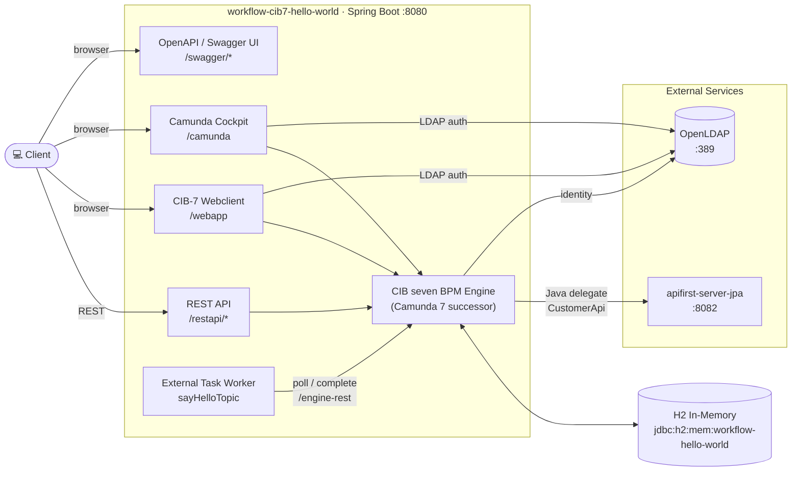
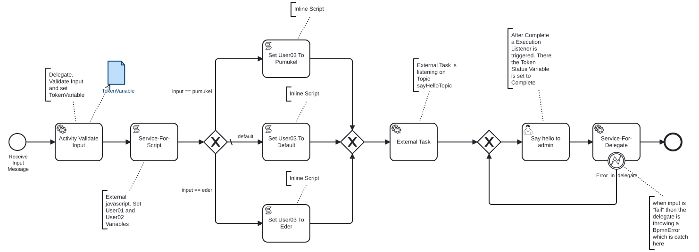

# CIB seven Hello World

## Abstract

`workflow-cib7-hello-world` is a Spring Boot reference application built on **CIB seven** — the open-source
successor of Camunda 7. It runs an executable BPMN 2.0 process (`hello-world-process`) that showcases the main
building blocks of the CIB seven engine:

- **User task** (`say-hello`) with candidate user and an execution listener
- **Java delegates** (input validation, say-hello) plus a **BpmnError** boundary event
- **Script tasks** — external JavaScript resource and inline scripts
- **External task** worker subscribed to the `sayHelloTopic`
- **Typed process variable** (`TokenVariable`) with a custom JSON deserializer

The application embeds the CIB seven engine, the CIB-7 webclient and the Camunda REST API, exposes Actuator
and OpenAPI/Swagger endpoints, authenticates against **OpenLDAP** and persists to an in-memory **H2**
database. It ships a Helm chart (incl. a local LDAP subchart) and Kubernetes manifests for deployment.

- [Architecture](#architecture)
- [Process](#process)
- [Description](#description)
- [Prerequisites](#prerequisites)
- [Build](#build)
- [Kubernetes](#kubernetes)
- [Sandbox](#sandbox)

## Architecture



## Process

The BPMN process `hello-world-process` (`src/main/resources/process.bpmn`) is started via
`POST /restapi/workflow` with an `input` variable. It validates the input and branches on its value (`eder`,
`pumukel`, default), sets a user variable via inline scripts, runs an external task, waits for the user task
`say-hello` and finally invokes the say-hello delegate — which calls the `apifirst-server-jpa` REST API and can
raise a `BpmnError` caught by a boundary event.



## Description

### URLS

Use 8080 when started locally or 30080 in Kubernetes

- Camunda Cockpit: 
  - http://localhost:8080/camunda/app/welcome/default/#!/welcome
  - http://localhost:30080/camunda/app/welcome/default/#!/welcome
- CIB-7 Cockpit: 
  - http://localhost:8080/webapp
  - http://localhost:30080/webapp
- Actuator: 
  - http://localhost:8080/actuator
  - http://localhost:30080/actuator
- Openapi:
  - http://localhost:8080/swagger/v3/api-docs
  - http://localhost:8080/swagger/v3/api-docs.yaml
  
  - http://localhost:8080/swagger/v3/api-docs/camunda-engine-rest-api
  - http://localhost:8080/swagger/v3/api-docs/camunda-engine-rest-api.yaml
  
  - http://localhost:8080/swagger/v3/api-docs/actuator
  - http://localhost:8080/swagger/v3/api-docs/actuator.yaml
  
  - http://localhost:8080/swagger/v3/api-docs/restapi
  - http://localhost:8080/swagger/v3/api-docs/restapi.yaml
  
  - http://localhost:8080/swagger-ui/index.html
  
- H2 Console: http://localhost:8080/h2-console (in the connection jdbc url use: jdbc:h2:mem:workflow-hello-world)
- Rest Api:
  - http://localhost:8080/restapi/camunda or http://localhost:30080/restapi/camunda
  - http://localhost:8080/restapi/ping or http://localhost:30080/restapi/ping
  - http://localhost:8080/restapi/workflow or http://localhost:30080/restapi/workflow

### Accessing Services

#### LDAP Database

- URL: `ldap://localhost:389` (local) or `ldap://localhost:30389` (Kubernetes NodePort)
- User: cn=admin,dc=example,dc=ch
- Password: password

All rest services can be executed via the `httprequest` folder using the `k8s` environment setting

### Servers

- local: localhost, database on h2 locally


## Prerequisites

- Java 25
- CIB seven 2.2.0 (Camunda 7 successor)
- Spring Boot 4.1.1
- Maven Wrapper (included, Maven 3.9.16)
- `~/.m2/settings.xml` is set
  up [Help](https://swp-confluence.atlassian.net/wiki/spaces/SWPIT/pages/411173348/How+to+Install+and+setup+maven#Setting-up-the-maven-settings)
- The `NOTUSED` run configs in `.run/` read passwords from `src/main/conf/`. To use them, rename
  `changeme-local.conf` → `local.conf` and `changeme-ci.conf` → `ci.conf` and fill in the LDAP password
  (`ldap.password`) and the engine DB password (`camunda.db.password`). The default `Application` run config uses
  the `local` profile and needs no env file.

## Build

| Usage         | Action                                                                   |
|---------------|--------------------------------------------------------------------------|
| Clean project | ./mvnw clean                                                             |
| Build project | ./mvnw package -Dskip.docker.build=true -Dskip.start.stop.springboot=true |
| Test project  | ./mvnw test                                                              |

Without the skip flags, `package`/`install` also builds the Docker image (`skip.docker.build=false`) and
starts/stops the Spring Boot app for its integration checks (`skip.start.stop.springboot=false`).

## Kubernetes

Deployment is done exclusively via Helm — the project has no raw Kubernetes manifests (`target/k8s/`). The
build packages the Helm charts (incl. the LDAP subchart) into `target/helm/repo`.

### Deployment with Helm

To run maven filtering and package the Helm charts:
```bash
./mvnw clean install -DskipTests -Dskip.docker.build=true -Dskip.start.stop.springboot=true
```

The chart is deployed into the `workflow-cib7-hello-world` namespace (not `default`).

Go to the directory where the tgz file has been created after `./mvnw install`
```powershell
cd target/helm/repo
```

unpack
```powershell
$file = Get-ChildItem -Filter workflow-cib7-hello-world-chart-*.tgz | Select-Object -First 1
tar -xvf $file.Name
```

install
```powershell
$APPLICATION_NAME = Get-ChildItem -Directory | Where-Object { $_.LastWriteTime -ge $file.LastWriteTime } | Select-Object -ExpandProperty Name
helm upgrade --install $APPLICATION_NAME ./$APPLICATION_NAME --namespace workflow-cib7-hello-world --create-namespace --wait --timeout 5m --debug
```

show logs and show event
```powershell
kubectl get pods -n workflow-cib7-hello-world
```
replace $POD with pods from the command above
```powershell
kubectl logs $POD -n workflow-cib7-hello-world --all-containers
```

Show Details and Event

$POD_NAME can be: workflow-cib7-hello-world-ldap, workflow-cib7-hello-world
```powershell
kubectl describe pod $POD_NAME -n workflow-cib7-hello-world
```

Show Endpoints
```powershell
kubectl get endpoints -n workflow-cib7-hello-world
```

uninstall
```powershell
helm uninstall $APPLICATION_NAME --namespace workflow-cib7-hello-world
```

delete all
```powershell
kubectl delete all --all -n workflow-cib7-hello-world
```

create busybox sidecar
```powershell
kubectl run busybox-test --rm -it --image=busybox:1.36 --namespace=workflow-cib7-hello-world --command -- sh
```

You can use the actuator rest call to verify via port 30080

## Sandbox

Entwicklung in einer isolierten Docker-Sandbox via [opencode-sandbox-kit](https://github.com/dboeckli/opencode-sandbox-kit).
Voraussetzungen: `sbx` CLI, Secrets (`sbx secret set github` + `sbx secret set github-maven`), IntelliJ-MCP-Registrierung
(`sbx mcp add idea --url http://localhost:64342/stream --skip-ssrf-check`).

Sandbox starten (PowerShell) — **mehrzeilig**, mit `--static-mcp idea`, gepinnter Template-Version und
**read-only Host-Maven-Cache** (kein Neu-Download gecachter Dependencies):

```powershell
sbx run opencode `
    --kit "git+https://github.com/dboeckli/opencode-sandbox-kit.git#dir=opencode-agent" `
    --template docker/sandbox-templates:opencode-docker-0.5.0 `
    --no-share-skills `
    --static-mcp idea `
    . `
    "$env:USERPROFILE\.kube:ro" `
    "C:\development\maven-repo:ro"
```

Claude-Variante (Home):

```powershell
sbx run claude `
    --kit "git+https://github.com/dboeckli/opencode-sandbox-kit.git#dir=opencode-agent" `
    --template docker/sandbox-templates:claude-code-docker-0.5.0 `
    --no-share-skills `
    --static-mcp idea `
    . `
    "C:\development\maven-repo:ro"
```

> **Sandbox-Quirk:** Vor jedem `./mvnw` in der Sandbox `export npm_config_bin_links=false` (Spotless/prettier bricht sonst mit EPERM im gemounteten Workspace).
